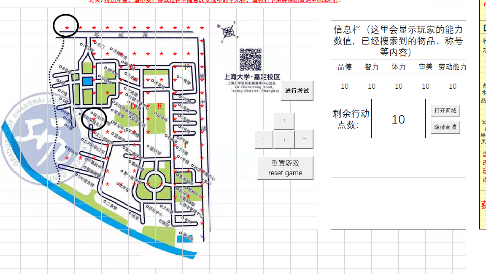

## A Excel VBA Game

**Chris Wang github@bellowaverage**

### 1. Project Overview

- This is a top-down exploration game that uses a map based on the Shanghai University Jiading Campus. In the game:
  - "\*" represents paths the player can walk on.
  - The black-filled square represents the player’s current position.
  - Uppercase English letters represent locations (cells) on the map that can be explored by moving the black square onto them.
  - Black-circled cells (H5 and J12 respectively) represent special locations: one is the physical test point, and the other is the academic test point.

  Player movement consumes action points. Exploring the map will affect the player’s ability stats, either increasing or decreasing them. At any time, the player can click "Reset Game" to restart or end the current game (drop out or graduate). When the game ends, the player receives a final score, which is calculated as their GPA based on the ability stats at the end of the game. The final score, player abilities, and any discovered items or titles contribute to the result. The score is unrelated to remaining action points or the number of items used during the game.

  **Important Notes:**
  - Do not arbitrarily change the selected cell during gameplay.
  - For the best experience, please adjust the screen zoom to around 40% (at the bottom right corner of the screen).

- The goal of the game is for the player to maximize their ability stats by using a limited number of action points. The final score depends on the player’s stats when the game is reset. The highest possible score is 4.0 (GPA), and the lowest is 0. Players can only earn a score if they haven’t used any shop items.

- The following is a snapshot of the game interface:



*Figure 1: Game interface on sheet1.*

### 2. Purpose and Significance of the Project Design

- This project simulates the basic operational model of modern games and establishes a data model to provide decision-making support for game designers. In modern game development, game operations are divided into two parts: the front-end game (gameplay) and the back-end data analysis. This project simplifies those concepts into:
  - **Front-end:** The game program (sheet1).
  - **Back-end:** Data analysis and storage (sheet2 to sheet4).

- The purpose of the game data analysis is to help designers make informed decisions about game mechanics and balance the trade-off between profitability and player enjoyment.

### 3. Design Ideas

> The **front-end** of the game, i.e., the gameplay interface (sheet1), includes:

- **Control Panel:** This consists of buttons that allow the player to move up, down, left, and right, interact with the map, and reset or end the game.
- **Information Bar:** This displays essential information, including:
  - Collected items (equipment).
  - Player’s current ability stats.
  - Titles and rewards earned.
- **Shop:** A section where players can purchase items using in-game currency, adding an element of monetization and interaction.
- **Game Display Area:** This visualizes:
  - The player (represented by a black square).
  - Paths (marked with "\*").
  - The background map.
  - Other elements such as buildings and special locations that players can explore.

> The **back-end** of the game records data from each playthrough for analysis. Data recorded includes:
  - The player’s final ability stats at the end of the game.
  - Items collected.
  - Final score (GPA).
  - Player feedback on the game experience.
  - Choices made during the game.
  - The number of times the shop was used and items purchased.
  - Total expenditure in the shop.
  
  This data is used to evaluate the balance between the game’s monetization strategy and its playability. Designers can adjust the game’s mechanics based on the analysis to optimize both player experience and profitability.

### 4. Core Code: Movement and Exploration Program

The following is the core VBA code that handles player movement and exploration mechanics within the game.

```vba
Sub testw()

If Range("ae11").Value > 0 Then ' Check if the player still has remaining action points

    originalcolumn = ActiveCell.Column ' Record the current column of the active cell
    row = ActiveCell.Row ' Record the current row of the active cell
    row = row - 1 ' Move up 1 cell

    If Cells(activecell.column, row).Value = " *" Then ' Check if the player is walking on a path

        Worksheets("sheet1").Cells(activecell.column, row).Interior.Color = vbred ' Color the target cell
        row = row + 1 ' Restore the row value
        Worksheets("sheet1").Cells(activecell.column, row).Clear ' Clear the original cell
        Worksheets("sheet1").Cells(activecell.column, row).Value = " *" ' Assign "*" to the original cell

        With Worksheets("sheet1").Cells(activecell.column, row).Font
            .Size = 36
            .Color = -1677696
            .Bold = True
        End With

        Cells(row - 1, originalcolumn).Select ' Select the current cell to ensure the active cell is updated

        Range("ae11").Value = Range("ae11").Value - 1 ' Decrease remaining action points by 1

    Else

        Select Case Range(colum & lie).Value

        Case "I"
            If IsEmpty(Sheet1.Range("ab17")) = False Then
                MsgBox "Cannot explore again!"
            Else
                If MsgBox("Are you sure you want to explore this area?", vbYesNo + vbInformation, "Game Tip") = vbYes Then
                    MsgBox "Welcome to Dorm 5! Congratulations, you've obtained the item: 'Dorm 5 Name List'! Rewards: Strength +5, Intelligence +2, Morality +3, Aesthetic +3, Labor Ability +5, Action Points +5", vbOKOnly, "Game Tip"
                    Range("ab9").Value = Range("ab9").Value + 3
                    Range("ad9").Value = Range("ad9").Value + 2
                    Range("af9").Value = Range("af9").Value + 5
                    Range("ah9").Value = Range("ah9").Value + 3
                    Range("aj9").Value = Range("aj9").Value + 5
                    Range("ae11").Value = Range("ae11").Value + 5
                    Range("ab17").Value = "'Dorm 5 Name List'"
                End If
            End If

        ' (Other cases like "F", "C", etc., follow similar logic)

        End Select

    End If

Else
    MsgBox "You have run out of action points. Please click 'Reset Game' to end the game. If this is not your first time playing or if you want to explore further, you can buy action points from the shop."
End If

End Sub
```

This code manages the movement of the player across the map, checks for valid paths, updates the player's position, and handles exploration of specific cells (like discovering items or encountering events).

### 5. Other Code: Exams, Shop, Data Collection, Game Reset, etc.

The game also includes various other components that handle exams, shop interactions, data collection, and resetting the game. These modules are implemented in the VBA code and provide additional depth and functionality to the game. For detailed implementations, please refer to the full VBA program.

### 6. Data Analysis

- **Player Exploration Interest Distribution Chart:** This visualizes which areas of the map players are most interested in exploring.

- **Player Choices in the "Wen De Building Event" Analysis:** This analyzes player decision patterns in the specific event to provide insights into their behavior and preferences.

- Additional analysis features are available within the VBA program, focusing on player behavior and game design evaluation.
